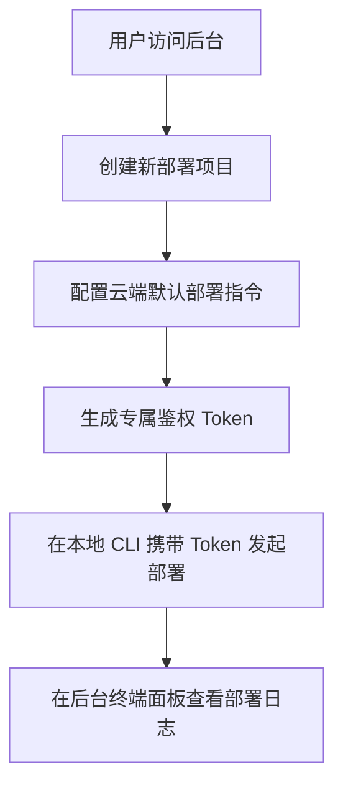

## 1. 产品概述
Kite 部署管理后台是一款轻量级、云原生的前后端项目自动化部署工具的 Web 可视化面板。
- 主要解决开发者管理多项目部署配置、令牌下发以及部署日志查看的需求。
- 提供极简、安全且可视化的管理体验，摒弃复杂的 SSH 配置。

## 2. 核心功能

### 2.1 用户角色
| 角色 | 注册方式 | 核心权限 |
|------|---------------------|------------------|
| 管理员 | 环境变量/本地预设 | 拥有项目的创建、配置修改、Token 生成及日志查看等全量权限 |

### 2.2 功能模块
1. **项目管理页**：项目列表展示、创建新项目、编辑项目配置（如默认前后置指令）。
2. **项目详情/配置页**：展示项目概览，管理 Token，配置默认脚本。
3. **日志看板页**：实时查看各项目的部署日志，支持历史部署记录回溯。

### 2.3 页面详情
| 页面名称 | 模块名称 | 功能描述 |
|-----------|-------------|---------------------|
| 仪表盘/首页 | 概览面板 | 展示项目总数、近期部署次数和成功率统计 |
| 项目列表页 | 项目卡片列表 | 展示已有项目卡片，包含项目 ID、名称、最后部署时间及状态 |
| 项目列表页 | 新建项目弹窗 | 录入项目名称、唯一标识符等信息 |
| 项目详情页 | 基础配置面板 | 配置平台云端默认的 `preDeploy` 和 `postDeploy` 指令 |
| 项目详情页 | Token 管理 | 生成、复制、废弃项目的专属 Token |
| 日志看板页 | 部署历史列表 | 展示每一次部署操作的时间、触发来源和状态 |
| 日志看板页 | 终端日志视图 | 模拟终端样式，展示部署时的详细 Shell 执行日志 |

## 3. 核心流程
用户通过管理后台创建项目，生成该项目的专属 Token，随后在本地 CLI 中配置该 Token 即可发起自动化部署，部署完成后在后台查看实时日志。

## 4. 界面设计设计

### 4.1 设计风格
- **主色调与辅助色**：采用极客风格的深色模式（Dark Mode），背景色使用深渊黑（#09090B），主色调搭配赛博蓝（#3B82F6）或极光绿（#10B981）作为高亮和成功状态，错误状态使用霓虹红（#EF4444）。
- **按钮样式**：微圆角（6px），带轻微发光效果或细边框，强调极客工具属性。
- **字体与大小**：界面使用 Inter 或系统默认无衬线字体，日志/代码/Token 区域必须使用等宽字体（JetBrains Mono 或 Fira Code）。
- **布局风格**：左侧边栏导航 + 右侧内容区的经典控制台布局。大量使用卡片（Card）式布局，卡片间距保持舒适的留白。
- **动画细节**：页面切换带淡入淡出，状态切换（如部署中）有细腻的呼吸灯效果。

### 4.2 页面设计概览
| 页面名称 | 模块名称 | UI 元素 |
|-----------|-------------|-------------|
| 全局框架 | 侧边栏导航 | 包含 "概览"、"项目管理"、"部署日志" 等菜单项，选中态带高亮发光侧边条 |
| 项目列表页 | 项目卡片 | 卡片包含微弱的发光边框、项目名、状态指示灯（红/绿/黄） |
| 项目详情页 | Token 区域 | 隐藏显示的密码框样式，带一键复制按钮与模糊遮罩 |
| 日志看板页 | 终端面板 | 纯黑背景，绿色/白色等宽文本，模拟命令行窗口，支持自动滚动到底部 |

### 4.3 响应式
桌面端优先，适配平板设备。针对日志查看和代码配置等复杂操作，在桌面大屏下提供最佳体验，移动端提供只读的数据概览。
